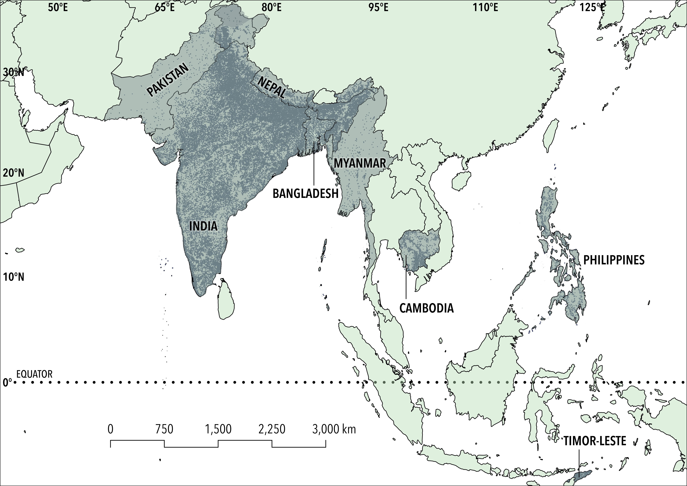

# Predictors of diarrhoea in children under five years old
Determine the most important predictors of diarrhoea in children under five in South and Southeast Asia (Pakistan, India, Nepal, Bangladesh, Myanmar, Cambodia, Philippines, Timor-Leste) by exploring the spatiotemporal association between diarrhoeal incidence and various behavioural, socio-demographic, and environmental factors.

 
 
Dr <a href="https://globalecologyflinders.com/people/#SHF">Syeda Hira Fatima</a> 
<a href="http://globalecologyflinders.com" target="_blank">Global Ecology</a> | <em><a href="https://globalecologyflinders.com/partuyarta-ngadluku-wardli-kuu/" target="_blank">Partuyarta Ngadluku Wardli Kuu</a></em>, <a href="http://flinders.edu.au" target="_blank">Flinders University</a>, Adelaide, Australia  
September 2024 
<a href=mailto:syeda.fatima@flinders.edu.au>e-mail</a>  
 
and 
 
Prof <a href="https://globalecologyflinders.com/people/#DIRECTOR">Corey J. A. Bradshaw</a>  
<a href="http://globalecologyflinders.com" target="_blank">Global Ecology</a> | <em><a href="https://globalecologyflinders.com/partuyarta-ngadluku-wardli-kuu/" target="_blank">Partuyarta Ngadluku Wardli Kuu</a></em>, <a href="http://flinders.edu.au" target="_blank">Flinders University</a>, Adelaide, Australia  
September 2024 
<a href=mailto:corey.bradshaw@flinders.edu.au>e-mail</a>  
 
Project collaborators: Dr <a href="https://www.researchgate.net/profile/Melinda-Judge">Melinda Judge</a>, Prof <a href="https://research-repository.uwa.edu.au/en/persons/peter-le-souef">Peter Le Souëf</a>, Dr <a href="https://loop.frontiersin.org/people/2658416/overview">Lewis Weeda</a>, <a href="mailto:Naomi.Hemy@thekids.org.au">Naomi Henry</a>
 
## Focal manuscript
Fatima, SH, MA Judge, PN Le Souëf, CJA Bradshaw. Impact of climate change on diarrhoea risk in low- and middle-income countries. In review.

## <a href="https://github.com/cjabradshaw/childDiarr/tree/main/scripts">Scripts</a>

- <code>DHSDiarrProcessing_1.R</code>: R code to load and merge DHS survey and GPS data and select the appropriate list of variables.
- <code>DHSDiarrProcessing_2.R</code>: R code to preprocess, recode, and create new variables where necessary.
- <code>DHSDiarrProcessing_3.R</code>: R code for imputation of variables with missing data.
- <code>DHSDiarrProcessing_4.R</code>: R code for processing of raster data.
- <code>DHSDiarrProcessing_5.R</code>: R code for processing of variables at the cluster level and standardization.
- <code>DHSDiarrAnalysis.R</code>: R code to reproduce the resampled boosted regression tree analysis for determining the relationships between probability of diarrhoea, and socio-economic, maternal, child, climate data.

## <a href="https://github.com/cjabradshaw/childDiarr/tree/main/data/brtdata">Data</a>
- <em>DHSclusterLevelDiarrData.csv.zip</em>: <a href="https://dhsprogram.com/data/">Demographic and Health Surveys</a> data summarised by cluster with central parameter (mean, proportion, etc.) and variance per cluster. Overlaid (cluster-level) climate data derived from <a href="https://www.worldclim.org/">WorldClim</a> <a href="https://www.worldclim.org/data/bioclim.html">bioclimatic variables</a> (mean annual temperature, temperature annual range, total annual precipitation, precipitation seasonality, and precipitation of the driest quarter). Unzip .csv data file prior to analysis.

## Required R libraries
- <code>cowplot</code>, <code>dismo</code>, <code>dplyr</code>, <code>foreign</code>, <code>gbm</code>, <code>GGally</code>, <code>ggplot2</code>, <code>ggpubr</code>, <code>gridExtra</code>, <code>haven</code>, <code>leaflet</code>, <code>mice</code>, <code>raster</code>, <code>reshape2</code>, <code>sf</code>, <code>sp</code>, <code>spatstat.random</code>, <code>tidyr</code>, <code>truncnorm</code>, <code>usdm</code>

 
 

 &nbsp;  &nbsp; &nbsp;  &nbsp; &nbsp; 
